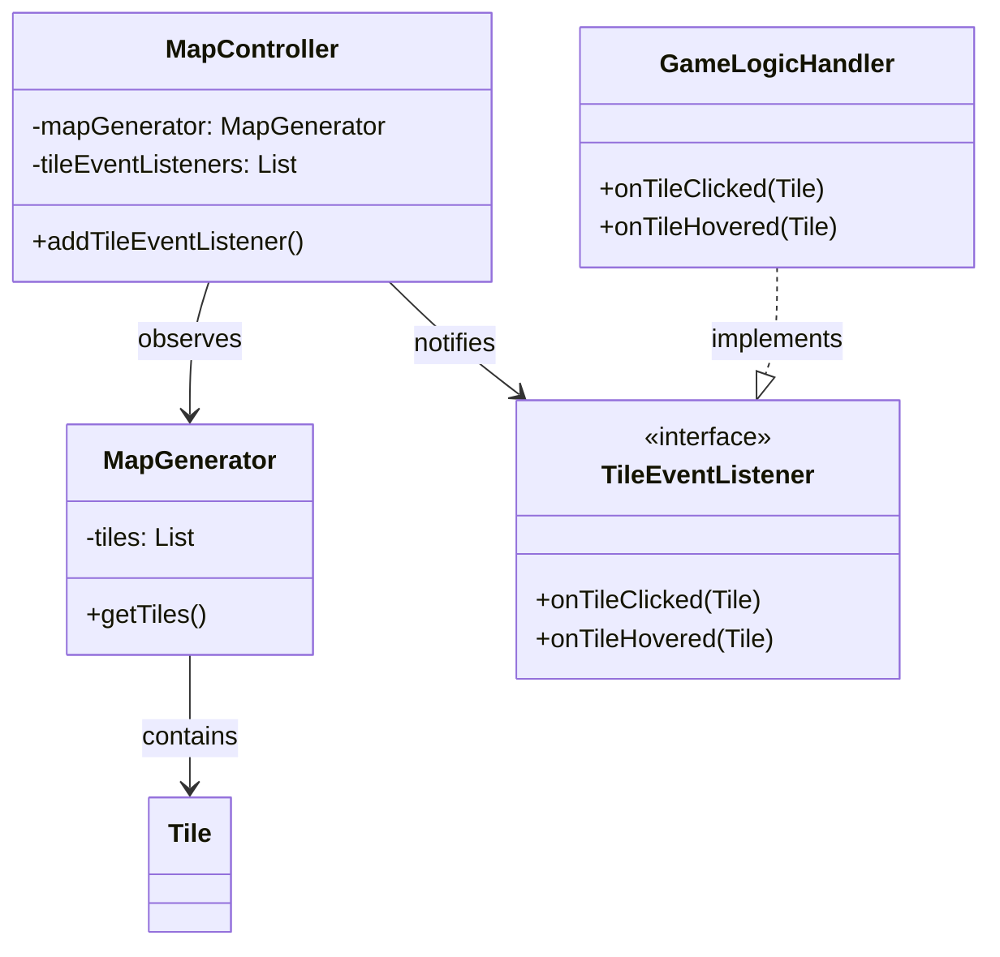

# Flujo de Eventos con Listeners

## Diagrama de Relaciones



## Flujo de Trabajo

1. **Inicialización**:

```java
MapGenerator panel = new MapGenerator(/*params*/);
MapController controller = new MapController(panel);
controller.addTileEventListener(new GameLogicHandler());
```

2. **Eventos de Usuario**:

- Usuario hace clic/hover en el mapa
- MapController recibe el evento
- MapController busca el tile afectado
- Notifica a todos los listeners registrados

3. **Procesamiento**:

```java
// En MapController
private void handleTileClick(MouseEvent click) {
    // 1. Busca el tile
    // 2. Notifica a los listeners
    for (TileEventListener listener : tileEventListeners) {
        listener.onTileClicked(tile);
    }
}
```

4. **Respuesta**:

- GameLogicHandler: Procesa lógica del juego
- Listeners UI: Muestran feedback visual

# Responsabilidades

- **MapGenerator**: Genera y dibuja el mapa
- **MapController**: Gestiona eventos y notificaciones
- **TileEventListener**: Define interfaz para reaccionar a eventos
- **GameLogicHandler**: Implementa lógica específica del juego

Este diseño sigue el patrón Observer y permite separar:

- Visualización (**MapGenerator**)
- Control de eventos (**MapController**)
- Lógica de negocio (**GameLogicHandler**)
